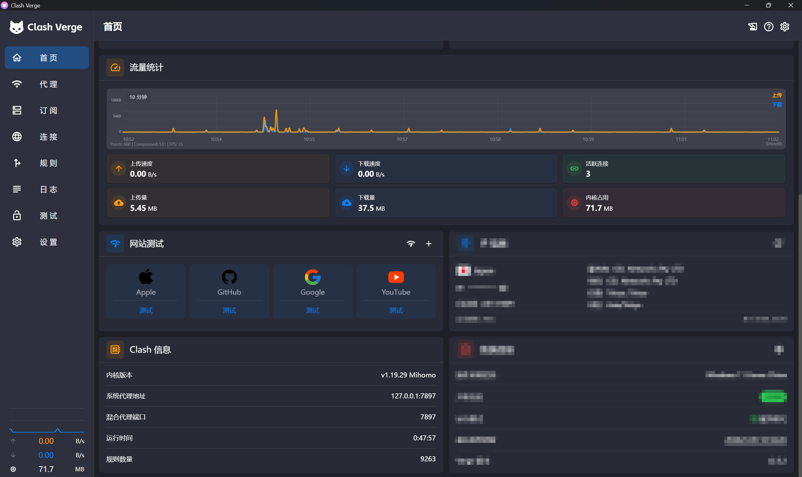
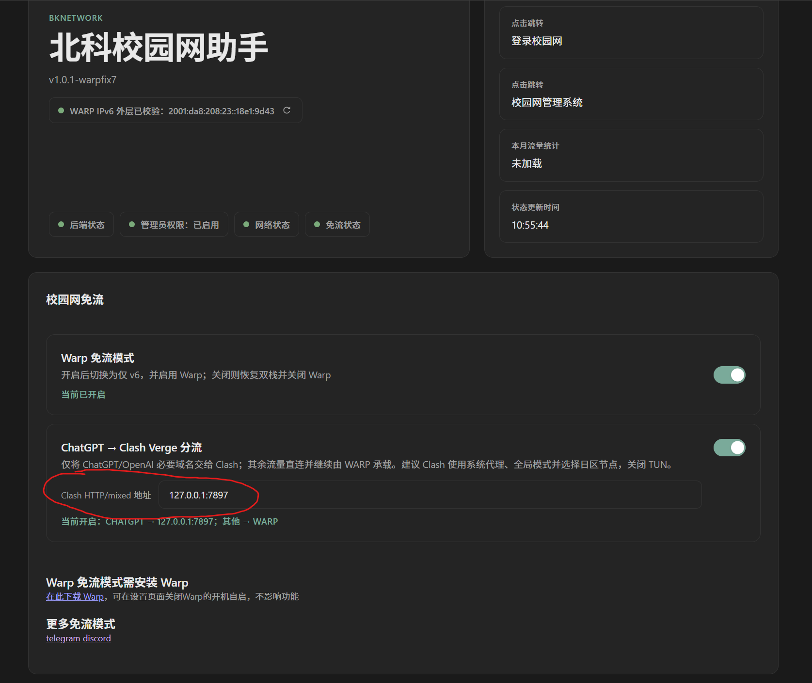

# Windows BKnetwork使用说明

仅限USTB_student和USTB_v6，USTB_WIFI不能免流

**高级模式** 显示更详细的网络状态与控制选项，方便进行单独设置

**设置** 页面可设置软件开机自启、静默启动、Warp 客户端开机自启等

## 环境配置

* 从release中解压缩最新版zip

* 网页安装[Cloudflare One Client](https://developers.cloudflare.com/cloudflare-one/team-and-resources/devices/cloudflare-one-client/download/)的最新windows版本（或者点击浏览器控制页面左下角“安装warp”按钮）

首次运行选择左侧 "Private browsing"，同意使用条款继续

* 安装[Npcap](https://npcap.com/#download)中的Npcap 1.88 installer

## 启动说明

### Clash Verge 设置

* 关闭 TUN 模式，避免 Mihomo 虚拟网卡抢占 WARP 的 IPv6 外层
* 打开系统代理
* 选择全局模式，并手动选择日区节点（只是方便使用ChatGPT，实则任意节点均可）
* 在 Clash Verge 设置中确认 HTTP/mixed 端口；常见默认地址是 `127.0.0.1:7897`（如果不是此地址，需要在浏览器控制页面给出你电脑的真实地址）

### BKNetwork 设置

* 先开启 Warp 免流模式并等待连接成功
* 在 `ChatGPT → Clash Verge 分流` 中填写 Clash 的 `127.0.0.1:端口`
* 开启分流，看到“ChatGPT → 端口；其他 → WARP”后，完全退出并重开 `ChatGPT classic` 和 `ChatGPT`

PS：此模式使用系统 PAC，只把 OpenAI/ChatGPT 必要的 HTTP、HTTPS、WebSocket 域名交给 Clash。其他系统代理流量为 DIRECT，仍由 WARP 承载。Clash 直连模式不会产生日区出口，因此不适合此用法。Voice 的原生 UDP 不受系统 PAC 控制，可能通过 WARP 或回退到 TCP 443。

## 关闭说明

* 完全退出 ChatGPT Classic 和 ChatGPT。

* 在 BKNetwork 页面关闭“ChatGPT → Clash Verge 分流”，等待 PAC 恢复。

* 在 BKNetwork 页面关闭“Warp 免流模式”。

* 关闭 Clash Verge 的系统代理。

