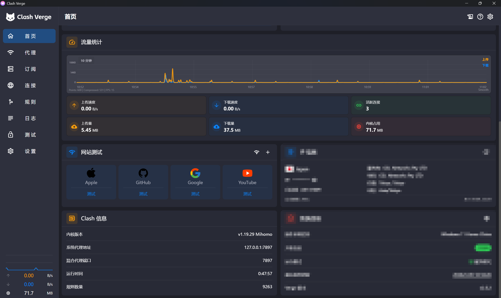
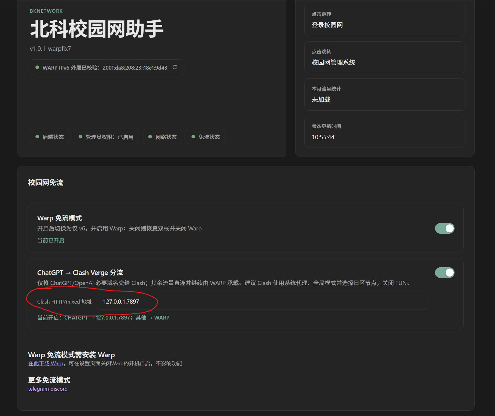

# Windows BKnetwork使用说明

仅限USTB_student和USTB_v6，USTB_WIFI不能免流

**高级模式** 显示更详细的网络状态与控制选项，方便进行单独设置

**设置** 页面可设置软件开机自启、静默启动、Warp 客户端开机自启等

## 环境配置

* 从release中解压缩最新版zip

* 网页安装[Cloudflare One Client](https://developers.cloudflare.com/cloudflare-one/team-and-resources/devices/cloudflare-one-client/download/)的最新windows版本（或者点击浏览器控制页面左下角“安装warp”按钮）

首次运行选择左侧 "Private browsing"，同意使用条款继续

* 安装[Npcap](https://npcap.com/#download)中的Npcap 1.88 installer

### 家庭网络 WireGuard（不使用 Cloudflare 的替代方案）

如果你的 Ubuntu 家庭服务器有可从校园网访问的公网 IPv6，且 UDP `51820` 已在路由器/防火墙和 Ubuntu 上放行，可以在此模式中替代 Cloudflare WARP。仅开放 UDP 端口还不够：Ubuntu 还必须启用 IPv4/IPv6 转发，为 `10.66.66.0/24` 配置 IPv4 NAT，并为隧道 IPv6 配置 NAT66 或可路由的回程前缀。

1. 在 Windows 安装[官方 WireGuard for Windows](https://www.wireguard.com/install/)，并先在官方客户端中导入家庭服务器的客户端 `.conf`；BKNetwork 只会枚举配置名称、启停该隧道服务，不会读取或保存配置中的私钥。
2. 配置的 `[Peer]` 建议至少包含：

   ```ini
   Endpoint = [你的家庭公网 IPv6]:51820
   AllowedIPs = 0.0.0.0/0, ::/0
   PersistentKeepalive = 25
   ```

   IPv6 Endpoint 必须用方括号。物理网卡只保留 IPv6 是为了保证外层链路不走校园 IPv4；`0.0.0.0/0` 则把 Windows 的内层 IPv4 流量封装进 WireGuard，二者并不冲突。还应在 `[Interface]` 中配置隧道 DNS，例如 `DNS = 1.1.1.1, 2606:4700:4700::1111`。
3. 以管理员身份运行 BKNetwork，在“家庭网络 WireGuard”卡片选择刚导入的隧道并开启。程序会先断开 WARP、把目标物理网卡切为仅 IPv6，并临时关闭该网卡 IPv6 的 `Forwarding` 与 `WeakHostSend`，避免外层报文回环。WireGuard 启动后，程序读取其公开的 IPv6 Endpoint，为端点添加经所选物理 IPv6 网关的 `/128` 临时路由，验证实际出口、双栈隧道路由、握手、隧道 IPv4 公网连接和 Windows DNS。
4. 联网后还会复核物理 IPv4 保持关闭、端点继续走物理 IPv6、业务流量经过隧道，全部通过才显示成功。内层 IPv4 网站访问仍封装在 IPv6 外层中，保留校园 IPv6 免流；配置为 IPv4 Endpoint 会被拒绝。
5. 断开或启动失败时，程序先停止隧道，再移除本次新增的端点路由、恢复原 IPv6 转发选项和普通双栈。恢复记录保存在 `%APPDATA%\BKNetwork\home-routing.json`，不含密钥；遇到恢复失败会保留记录并提示重试关闭。发送计数增加但没有回包时，程序会提示核对本机外层路由、传输链路和服务端回程，避免直接认定 Ubuntu 配置错误。

以上保护需要使用 BKNetwork 的家庭网络开关。直接在官方 WireGuard 中连接不会经过 BKNetwork 的启动检查与修复流程。

> 使用家庭网络时不要同时开启 WARP 免流模式；BKNetwork 会在切换时自动关闭另一方。Clash Verge 的系统代理模式可以继续使用，`127.0.0.1` 回环连接不受影响；不要同时开启 Clash TUN。

## 启动说明

### Clash Verge 设置

* 关闭 TUN 模式，避免 Mihomo 虚拟网卡抢占 WARP 或家庭 WireGuard 的默认路由
* 打开系统代理
* 选择全局模式，并手动选择日区节点（只是方便使用ChatGPT，实则任意节点均可）
* 在 Clash Verge 设置中确认 HTTP/mixed 端口；常见默认地址是 `127.0.0.1:7897`（如果不是此地址，需要在浏览器控制页面给出你电脑的真实地址）





### BKNetwork 设置

* 先开启 WARP 免流模式或家庭 WireGuard，并等待 BKNetwork 确认联网成功
* 在 `ChatGPT → Clash Verge 分流` 中填写 Clash 的 `127.0.0.1:端口`
* 开启分流，看到“ChatGPT → 端口；其他 → 当前网络（WARP/家庭 WireGuard）”后，完全退出并重开 `ChatGPT classic` 和 `ChatGPT`

PS：此模式使用系统 PAC，只把 OpenAI/ChatGPT 必要的 HTTP、HTTPS、WebSocket 域名交给 Clash。其他系统代理流量为 DIRECT，仍由当前的 WARP 或家庭 WireGuard 承载。Clash 直连模式不会产生日区出口，因此不适合此用法。Voice 的原生 UDP 不受系统 PAC 控制，可能通过当前隧道或回退到 TCP 443。

## 关闭说明

* 完全退出 ChatGPT Classic 和 ChatGPT。

* 在 BKNetwork 页面关闭“ChatGPT → Clash Verge 分流”，等待 PAC 恢复。

* 在 BKNetwork 页面关闭“Warp 免流模式”。

* 关闭 Clash Verge 的系统代理。

